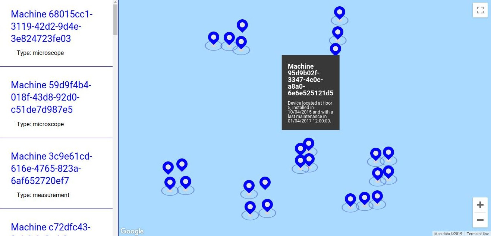
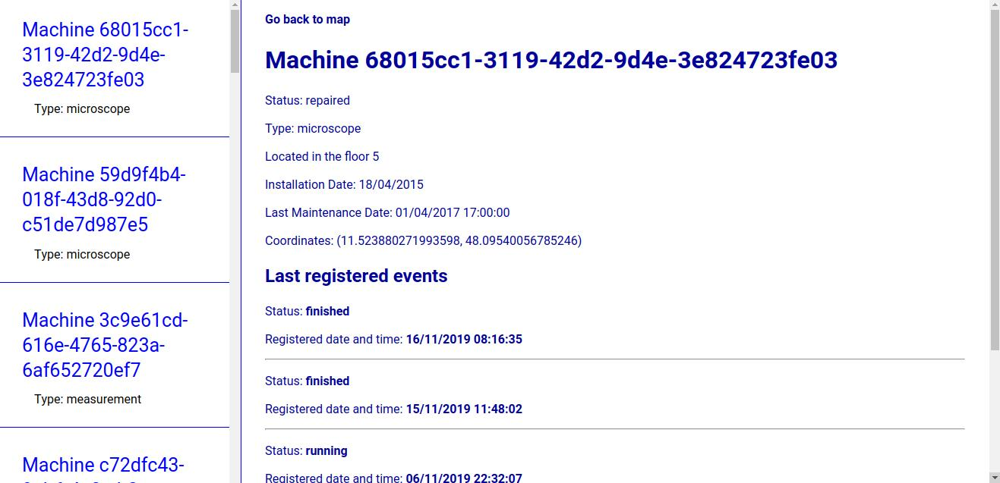

# Smapiot Software Engineer Test - 11.2019

Study case test for Smapiot software engineer position. Developed a front-end solution for the demanded requirements using mainly Typescript 3.7.2 and React 16.9.13. 

[Demo version with Zeit](https://build.davikawasaki.now.sh/)





## Background

---

As company in the IoT space, we are also required to offer apps and tools to visualize the connected devices including the currently streamed data. Quite often we the simplest approach is to create a small single-page application for visualize what we receive in the backend.

For a client that has many of his devices in the field of optics connected to our backend we should write an accessible single-page application that loads very fast and displays relevant information of the connected devices in real-time. The client is particularly interested in being notified when a device sends data.

A strong requirement from the customer was to display the connected machines on a map. This way the users can already get the locality information without having to know the GPS coordinates by heart.

## Inquiries and Considerations

---

Q: *We created a WebSocket endpoint using Phoenix. This endpoint should help you to connect to the solution and show a quick indicator / notification when a particular machine sent some data.*

> This solution focused on delivering only data through the HTTP API provided in order to focus on delivering a more complete product in the end. So no websocket was implemented.

Q: *We will eventually also need to integrate more into the simple client. Already think about how authentication, access management, data export, and responsive design may apply here.*

> Authentication: a simple token-based authentication implementation should suffice, storing the generated tokens in session storage. In terms of organization and design pattern, a service class similar to the *APIService.tsx* can be created for this purpose.

> Access Management: the access to specific pages or components can be set right into the components or a major organism that store all of the latters. In order to verify the user type, for example, the info should be extracted, decoded (encoding is for security reasons) from either the local storage or through *useContext* global hook, depending on how volumous the data is at hand.

> Data export: for this case it depends on what export process is going to be taken into evaluation. In case of small generated reports, this can be done through specific modules (i.e. separated responsibilities in distinct modules) directly in the front-end; on the other hand, for big quantity of data the process should be covered through proper back-end pipelines.

> Responsive design: this should be covered implementing media queries from zero (as a simple solution) or some other library that has all size breakpoints already implemented (e.g. Bootstrap, AntDesign, Material Design, etc). For a fast solution, the stylesheets were separated into simple *.css* files, which can be enhanced to SASS or LESS, embellishing and empowering the pages.

Q: *Furthermore, the client asked us to potentially also provide an app in the near future – what options do we have here?*

> Three main options, depending on the target market: using a **service worker** as a Progressive Web Application (covering offline cases and installation directly from the browser), migrating the code to React Native (firstly separating responsibilities into modules, removing all unecessary libraries and then transplanting specific codes that are not agnostic), or moving all the business logic to specific native languages (increased effort for performance-wise scenarios).

Q: *What components and aspects are important for the design of such a single-page application?*

> First of all, understanding the requirements and how these are translated into main organisms. After that, a balanced decision should be evaluated in terms of framework/library, design patterns and mainly reusability. In that term, modularizing reusable components should be one of the cornerstones of the project, altogether with separating any apparent business logic from the layout items.

Q: *What is the recommended approach for implementing such a software design?*

> Besides modularizing the components to be reused (i.e. map, device details), a recommended approach would be analyzing an estimate of target groups (i.e. in terms of quantity of users and their characteristics) and having a holistic overview architectural and layout-wise, especially taking into consideration which elements should be eagerly prioritized with less perfection. All in order to balance getting a sustainable and fast MVP on the market :)

Q: *What are the pros and cons of your design?*

> Pros: as any expected modern web-based application, the usage of types covers pretty much either unsafe variable scenarios as well as speeding code development and maintenance; separation into modules allows scalability on a medium to long term scenario; design patterns and good industry practices allow the development team to have a better working experience; separation into models shows easiness to not only refactoring but also better business documentation; user can see the running devices by the ones that have beacon pulses.

> Cons: lack of web socket implementation, more in-depth errors validation, lack of synchronization between sidebar and map (i.e. pub-sub or global context event dispatches), lack of unit tests (especially for data manipulation and effects between distinct model components), cache implementation, lack of an aesthetic design, distinction between different type of devices and their operations layout-wise, multiple useState hook updates.

Q: *How would you address the aspects of security and performance?* 

> Security: as said before, encoding the most sensible data, using a authentication protocol (e.g. OAuth, SAML), blocking any type of DOM modification through the browser.

> Performance: memoization, cache through local storage or state management, filtering/reusing libraries, reassing big files/data load after essential info is loaded, avoid overflowing pages and components, delegating responsibilities along the whole chain of components.

Q: *What about browser compatibility?*

> Mainly through the usage of polyfills (i.e. core-js, react-app-polyfill) and font adaptation (e.g. Mozilla Firefox has a different font rendering outcome).

Q: *Does it run on mobile?*

> Some functionalities might be affected, but in a nutshell it does.

## How to run

---

- Make sure you have NodeJS 8.15.1+ and npm installed:

```bash
node -v  # v8.15.1
npm -v   # 6.4.1
```

- Run the packages installation in the root folder:

```bash
npm i
```

- Start the React application (a web browser session will be open):

```bash
npm start
```